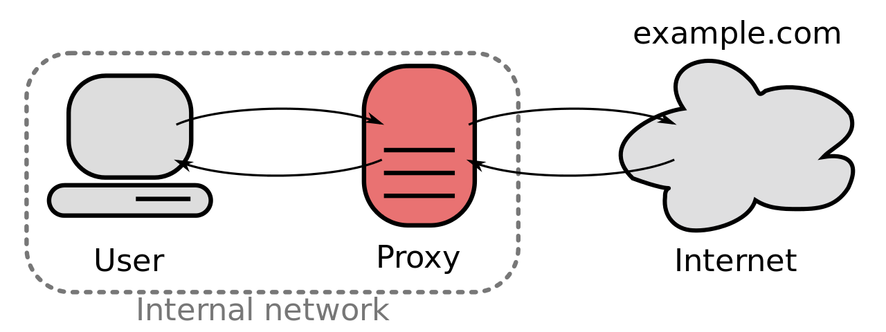

# Proxies: A Crash Course
Remember this picture from Lab 100? Let's go a bit more in-depth. 


### What is a proxy server?
A [proxy server](https://en.wikipedia.org/wiki/Proxy_server) is just 
an intermediary between us and the open internet.  It allows for filtering 
of web content, logging/eavesdropping, and when combined with a firewall
a high level of security.  

### How does my browser already know about the proxy? 
Most companies pre-configure machines with a 
[PAC (Proxy auto-configuration)](https://en.wikipedia.org/wiki/Proxy_auto-config) file. 
This file contains a javascript function which takes in a url and returns
the appropriate proxy (which can be no proxy at all if the resource is internal). 
The proxy file is usually located at [http://wpad/wpad.dat](http://wpad/wpad.dat) or [http://proxy/proxy.pac](http://proxy/proxy.pac)
and looks like this...
```js
// My-Corp : <IP>/<BLOCK> : Fri Sep  8 04:15:09 2017
// blah blah blah
//
function FindProxyForURL(url, host)
{
    normal = "DIRECT";
    proxies = "PROXY www-proxy.us.big-corp.com:80; PROXY www-proxy2.us.big-corp.com:80; DIRECT;";
    //patterns to always go DIRECT
    directs1 = /\.cpp-gde2\.industry\.com\.?$|^cpp-gde2\.industry\.com\.?$/;
    directs2 = /\......./;
    ... 
    ... //more regex
    ...
    // Make everything lower case.
    url = url.toLowerCase();
    host = host.toLowerCase();
    if (isPlainHostName(host)) return normal;
    if (specificproxy1.test(host)) return "PROXY www-proxy-ny.us.big-corp.com:80";
    if (alwaysproxy1.test(host)) return proxies;
    ... 
    ... //more regex tests returning proxies
    ...
    if (directs57.test(host)) return normal;
    ... 
    ... //more regex tests returning no proxy
    ...
    // bail out
    return proxies;
};

```
The line 
```js
proxies = "PROXY www-proxy.us.big-corp.com:80; PROXY www-proxy2.us.big-corp.com:80; DIRECT;";
```
contains the proxy you'll (usually) want to use, `www-proxy.us.big-corp.com:80`.
Most services will want the proxy in the form `<PROTOCOL>://<ADDRESS>:<PORT>`, 
so `http://www-proxy.us.big-corp.com:80`. This tells our service that we're using 
a `http` proxy on port `80` (it seems like DUH! http is always port 80! but you need to specify these things).  

# Getting "around" proxies
The only way to "get around" a proxy is to log off the intranet and onto the internet, 
which is what you do when you log onto the guest network. 
The only other way out is through the proxy, which can be dangerous... 
but if you take this workshop with you on your journey you will be safe.  


[Common Proxy Commands](Proxy-Commands.md)